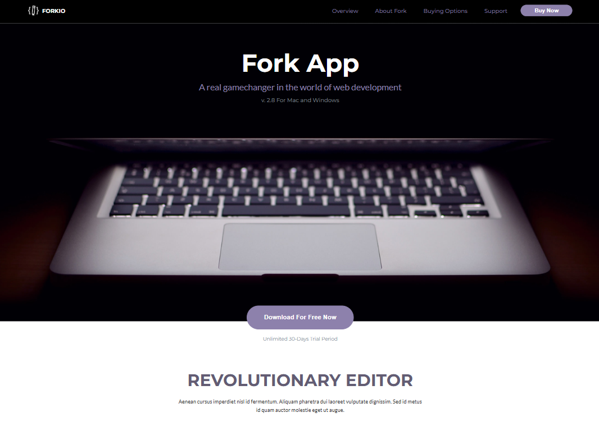
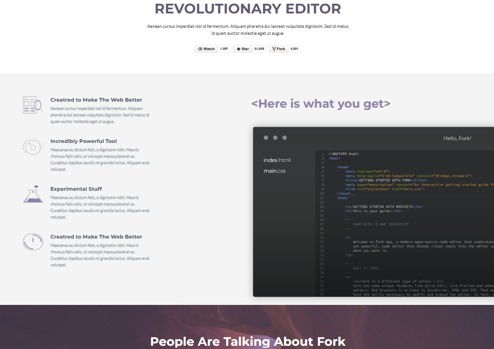
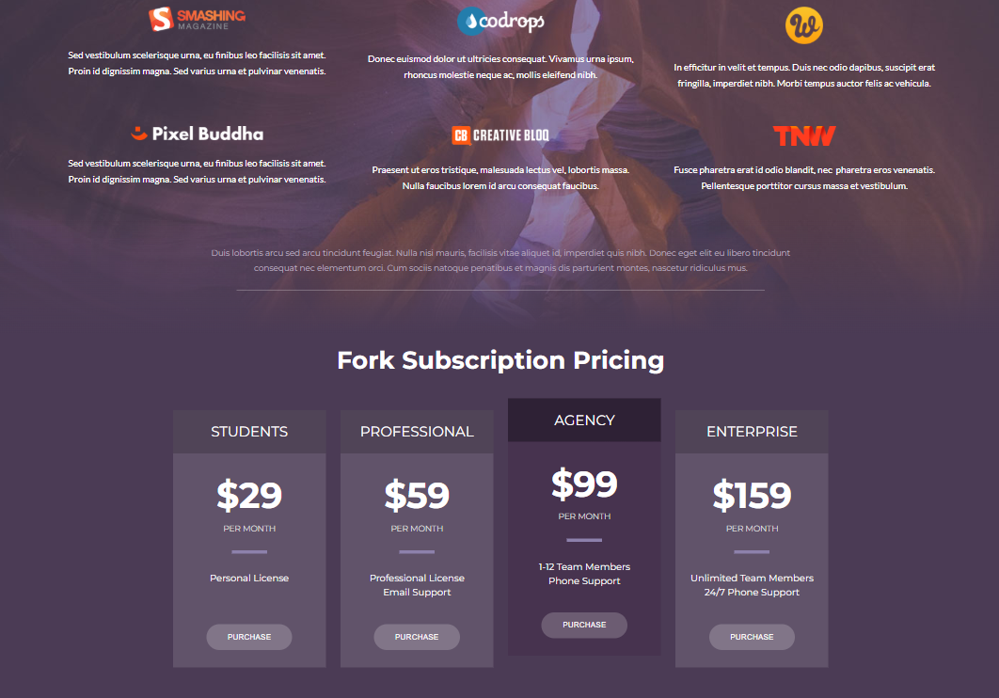
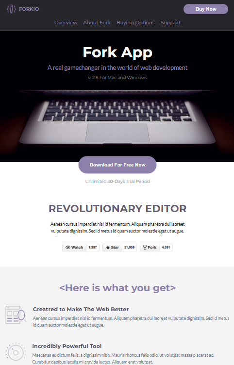
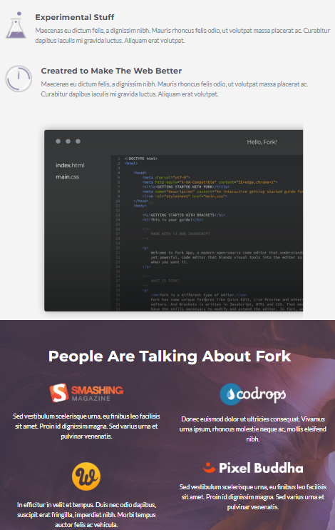
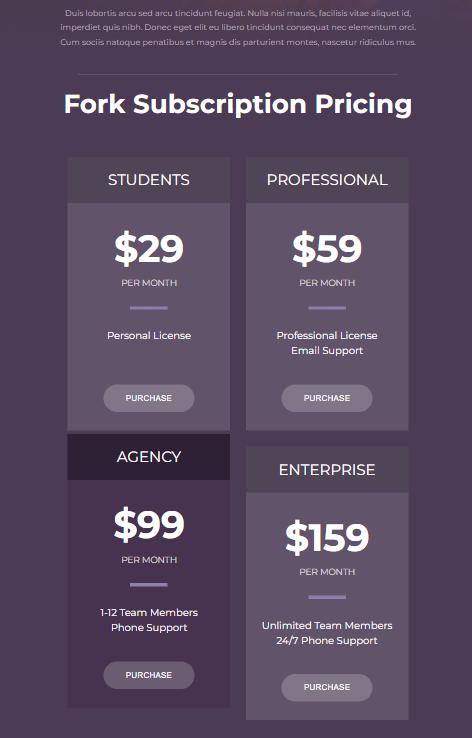
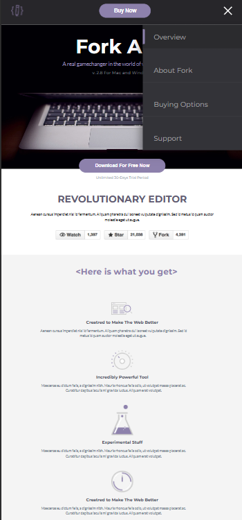
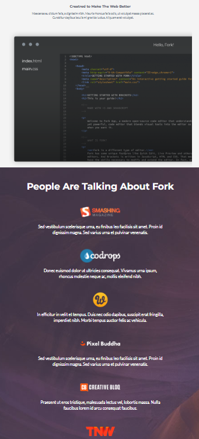
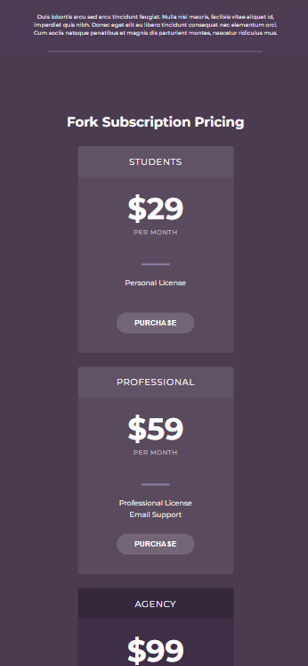

# Responsive Page

Bu layihə **HTML, CSS və JavaScript** istifadə edilərək hazırlanmış responsiv veb səhifədir.

Layihənin əsas məqsədi veb səhifənin **Desktop, Tablet və Mobile** ekran ölçülərinə uyğun şəkildə hazırlanması və responsiv dizayn prinsiplərinin tətbiq edilməsidir.

---

##  Layihə haqqında

Bu layihədə müxtəlif ekran ölçüləri üçün uyğunlaşan müasir landing page hazırlanmışdır.

Layihədə aşağıdakı hissələr mövcuddur:

* Header və naviqasiya menyusu
* Hero bölməsi
* Revolutionary Editor bölməsi
* Benefits bölməsi
* Community bölməsi
* Pricing bölməsi
* Responsive hamburger menyu
* Smooth scrolling
* Desktop, Tablet və Mobile görünüşləri

---

## 🛠️ İstifadə olunan texnologiyalar

* **HTML5** — səhifənin strukturunun yaradılması
* **CSS3** — dizayn və responsivlik
* **JavaScript** — hamburger menyunun idarə olunması
* **Flexbox** — elementlərin yerləşdirilməsi
* **CSS Grid** — grid strukturlarının yaradılması
* **Media Queries** — müxtəlif ekran ölçülərinə uyğun dizayn

---

##  Əsas xüsusiyyətlər

###  Header

Header bölməsində:

* Forkio loqosu
* Naviqasiya menyusu
* Buy Now düyməsi
* Mobile üçün hamburger menyu

yerləşdirilmişdir.

Desktop və tablet görünüşlərində naviqasiya menyusu göstərilir. Mobile görünüşündə isə menyu hamburger ikonuna çevrilir.

---

###  Hamburger menyu

Mobile görünüşündə hamburger menyunun açılıb-bağlanması JavaScript vasitəsilə həyata keçirilmişdir.


###  Smooth Scrolling

Səhifədə bölmələr arasında daha hamar keçid üçün CSS-də `scroll-behavior` istifadə edilmişdir:

```css
html {
    scroll-behavior: smooth;
}
```

Bu xüsusiyyət səhifə daxilində keçidlərin daha rahat görünməsini təmin edir.

---

##  Hero bölməsi

Hero bölməsində:

* **Fork App** başlığı
* Veb development haqqında açıqlama
* Versiya məlumatı
* Əsas şəkil
* Download düyməsi

yerləşdirilmişdir.

---

## ⚡ Revolutionary Editor

Bu bölmədə layihənin əsas xüsusiyyətlərini təqdim edən:

* Bölmə başlığı
* Açıqlama mətni
* GitHub düymələri

yerləşdirilmişdir.

---

## 🧰 Benefits bölməsi

Benefits bölməsində müxtəlif xüsusiyyətləri təqdim edən kartlar yaradılmışdır.

Kartlarda aşağıdakı mövzular göstərilir:

* Created to Make The Web Better
* Incredibly Powerful Tool
* Experimental Stuff
* Digər məhsul xüsusiyyətləri

Desktop görünüşündə kartlar və editor şəkli yan-yana yerləşdirilir.

Tablet və Mobile görünüşlərində isə elementlərin yerləşməsi ekran ölçüsünə uyğun olaraq dəyişdirilir.

---

## 👥 Community bölməsi

Community bölməsində Fork haqqında fikirlərin təqdim edildiyi kartlar yerləşdirilmişdir.

Hər kartda:

* Logo
* Açıqlama mətni

mövcuddur.

Desktop görünüşündə kartlar çoxsütunlu grid formasında, daha kiçik ekranlarda isə uyğun responsiv formada göstərilir.

---

## 💳 Pricing bölməsi

Pricing bölməsində 4 fərqli abunəlik planı yaradılmışdır:

| Plan         | Qiymət |
| ------------ | -----: |
| Students     |    $29 |
| Professional |    $59 |
| Agency       |    $99 |
| Enterprise   |   $159 |

**Agency** planı digər kartlardan fərqli olaraq aktiv vəziyyətdə xüsusi dizaynla göstərilmişdir.

---

# 📸 Ekran görüntüləri

Layihənin ekran görüntüləri `screenshotss` qovluğunda yerləşdirilmişdir.

## 🖥️ Desktop

### Desktop 1



### Desktop 2



### Desktop 3



---

## 📱 Tablet

### Tablet 1



### Tablet 2



### Tablet 3



---

## 📱 Mobile

### Mobile 1



### Mobile 2



### Mobile 3



---


#  Layihəni işə salmaq

Layihəni lokal olaraq işlətmək üçün:

1. Repository-ni klonlayın:

```bash
git clone https://github.com/hesenovasonaa/Responsive-Page.git
```

2. Layihənin qovluğuna daxil olun:

```bash
cd Responsive-Page
```

3. `index.html` faylını brauzerdə açın.

Alternativ olaraq VS Code-da **Live Server** extension-dan istifadə edərək layihəni işə salmaq mümkündür.

---


Layihənin əsas məqsədi HTML, CSS və JavaScript biliklərini, xüsusilə də **responsive design** bacarıqlarını praktiki şəkildə tətbiq etməkdir.
